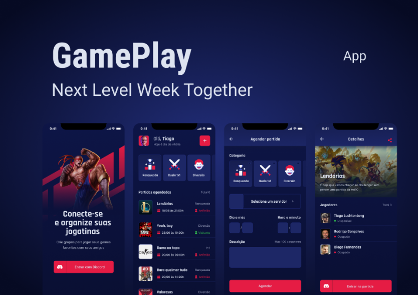

<div>
    <h1 align="center">
        
        <h1 align="center">GAMEPLAY</h1>
    </h1>
</div>
<p>Aplicativo para lhe ajudar a conectar-se e organiza o momento de diversão e jogar com os amigos. Crie grupos para jogar seus games favoritos com seus amigos com esse App que possui autenticação com Discord.</p>
<h4 align="center"> 
	🚧  Status 🚀 Iniciando o projeto  🚧
</h4>

<h1 align="center">
  
</h1>
<p text-align="justify">Este repositório tem foco, na criação de um aplicativo utilizando o React Native que tem como finalidade conectar os amigos para facilitar na hora de jogar com os amigos. Projeto inicial para iniciar os estudos no mobile.</p>
<p text-align="justify">Este projeto faz parte do meu portfólio pessoal, então, ficarei feliz caso você forneça algum feedback, código, estrutura, funcionalidade ou qualquer melhoria que você possa relatar para melhora-lo.Você pode usar este projeto como quiser, seja para estudar, fazer melhorias, você quem manda!.</p>

<blockquote>
Este é um projeto totalmente grátis!
</blockquote>

### 🏁 Features

- [ ] Autenticação Social OAuth2 com servidor do Discord.
- [ ] Obtém perfil do usuário cadastro no Discord (username e avatar);
- [ ] Lista os servidores do Discord que o usuário faz parte;
- [ ] Permite realizar o agendamento de partidas;
- [ ] Permite filtrar as partidas por categoria;
- [ ] Exibe se a partida foi agendada em um servidor próprio (anfitrião) ou em servidores de outros (convidado);
- [ ] Compartilha o convite para ingressar no servidor do usuário;
- [ ] Permite redirecionar o usuário para o seu próprio servidor;
- [ ] Disponibiliza a função de Logout.

### 🛠 Tecnologias
<p>As seguintes ferramentas foram usadas na construção do projeto:</p>

- [React Native](https://reactnative.dev/)
- [Typescript](https://www.typescriptlang.org/)
- [Expo](https://docs.expo.io/)
- [Context API](https://reactjs.org/docs/context.html)
- [React Native](https://reactnative.dev/)
- [Async Storage](https://reactnative.directory/?search=storage)
- [Vector Icons](https://www.vecteezy.com/free-vector/icons)
- [React Native Svg e Svg Transform]
- [Axios](https://axios-http.com/docs/intro)
- [Gradient colors](https://uigradients.com/#SlightOceanView)
- [OAuth2 Discord](https://discord.com/developers/docs/topics/oauth2)
- [Expo Google Fonts](https://docs.expo.io/guides/using-custom-fonts/)
- [React Navigation Stack](https://reactnavigation.org/docs/stack-navigator/)
- [React Native Gesture Handler](https://docs.swmansion.com/react-native-gesture-handler/docs/)
- [Expo Authentication](https://docs.expo.io/guides/authentication/)
- [React Native Share](https://www.npmjs.com/package/react-native-share)
- [Deep Link](https://developer.android.com/guide/navigation/navigation-deep-link) 

<h4>Iniciando o Projeto</h4>

```
expo start

```

